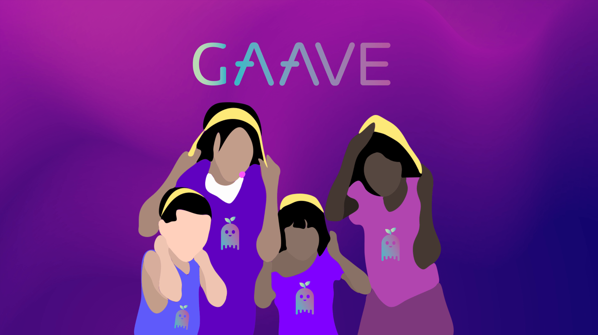
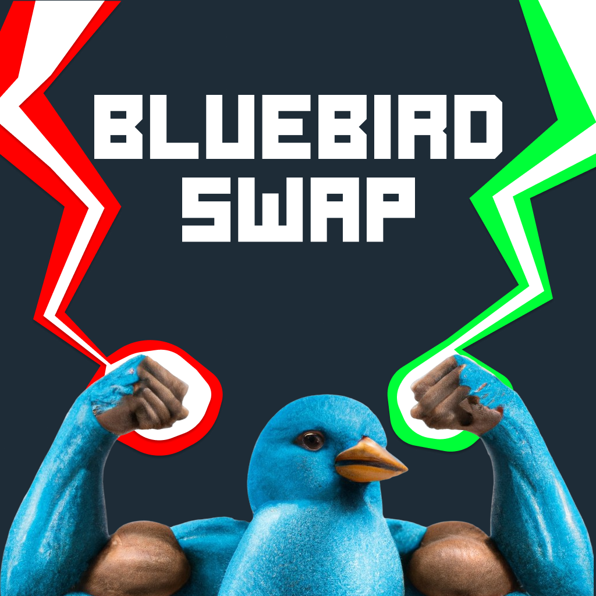

# Jun Meng - Blockchain Engineer

  

    
  

Hi there! I am a blockchain engineer with a passion for decentralized technologies and their potential to change the world.

## Skills
- Strong knowledge of blockchain technologies such as Ethereum, Bitcoin, and Hyperledger
- Experience with smart contract development using Solidity and other programming languages
- Understanding of consensus algorithms, cryptography, and network security
- Familiarity with Web3 technologies such as Dapps, IPFS, and decentralized exchanges
- Ability to integrate blockchain solutions with existing systems and platforms

## Projects

### GAAVE - Charity Yield Farming (ETH Seoul 2022)
### 🥇 Public Goods Track Winner 🏆 IPFS/Filecoin Sponsor Prize 🏆 The Graph Sponsor Prize

GAAVE is a yield farming for charity platform built by team GigaChads at ETH Seoul 2022.

A platform where crypto users could deposit their cryptocurrencies to generate yield for a cause. To further drive engagement, soulbound NFTs would be available for claim whenever a user reaches certain milestone when generating yield for a cause.

https://github.com/GigaChadds

### PreshMail - Decentralized Chat App with Attention Monetization (ETH SanFrancisco 2022)
### 🏆 Lens Protocol — Integration 🏆 XMTP — Runner Up 🏆 Push Protocol — Runner Up

Modern day social media is plagued with ads and people sending unsolicited messages to strangers due to the ease of doing so via bots and automation. We feel that it is unfair that you have to waste your precious attention on spam and unwanted messages.

Ad services such as Google Ad sense helps you to monetize your attention to a certain degree, but what if we could democratize this whole process?

There are existing solutions out there to do exactly this, such as the Brave browser, but there has not been one in the area of text messaging.

https://github.com/Omegachads

https://ethglobal.com/showcase/preshmail-rnuzb

### BluebirdSwap - On-chain Fractionalised NFT Options Trading  (ETHDenver #BUIDLathon 2023)
### 🏆 The Graph — Best New Subgraph(s)

NFTs (Non-Fungible Tokens) have become increasingly popular in recent years as a way to represent unique digital assets such as artwork, music, and video game items. However, high-value NFTs can be expensive and illiquid, making it difficult for smaller investors to gain exposure to the market.

With BluebirdSwap, users can buy and sell fractional ownership of NFTs, which makes it possible for smaller investors to participate in the market. This allows users to buy a share of a valuable NFT without having to pay the entire price upfront. Fractional ownership also allows investors to diversify their portfolios by owning a stake in multiple NFTs. BluebirdSwap provides a new way to speculate on the value of these assets. This is not possible on OpenSea or other NFT marketplaces, which only support direct trading of NFTs.

In addition to fractionalized NFTs, BluebirdSwap also offers an options trading platform for NFTs. Users can buy calls or puts on fractionalized NFTs, which allows them to potentially profit from price movements without having to buy the entire asset. This provides flexibility and risk management for investors who may not want to take on the full risk of owning an entire NFT. The premium for the options contracts is paid in the specific fractionalized NFT tokens.

https://github.com/Web3Rizzards

https://app.buidlbox.io/projects/bluebirdswap

### Multinate - Cross-Chain Donation Aggregator  (ETHGlobal ScalingEthereum 2023)
### 🏆 Hyperlane — Best use of Hyperlane Warp Routes 🏆 UMA & Across — Pool Prize

Multinate is a cross-chain donation aggregator designed to streamline charitable fundraising by enabling donors from multiple blockchain ecosystems to contribute in the ERC-20 token of their choice. Our platform simplifies the donation process, enhances transparency, and empowers charities to withdraw the raised funds in USDC, facilitating the efficient allocation of resources.

Key Features:

Snapshot.org Integration: Multinate utilizes Snapshot.org to initiate fundraising campaigns, providing a preliminary assessment of a charity's legitimacy. Charities submit proposals on our dedicated Multinate space, and these proposals must garner more votes in favor than against to pass.

Gnosis Safe Account and Optimism's AttestationStation: Once the proposal is approved, the platform automatically creates a campaign through a Gnosis Safe account. At this stage, our system connects to Optimism's AttestationStation contract to ensure that the charity meets the minimum attestation score, which is based on four attested criteria from a trusted third party.

Multi-Chain Support: Multinate supports donations from various blockchain ecosystems, including Scroll Alpha, Optimism Mainnet, and Gnosis Mainnet. This broad compatibility enables donors to contribute using their preferred blockchain and token, making it easier than ever to support charitable causes.

USDC Withdrawals: Charities can efficiently access the funds raised through our platform by withdrawing them in USDC, ensuring a seamless and straightforward process from campaign initiation to fund allocation.

https://github.com/Multinate/web3-donation-aggregator

https://ethglobal.com/showcase/multinate-kgqay

## Contact

Feel free to reach out to me through [junmtan.eth@gmail.com](mailto:junmtan.eth@gmail.com) or connect with me on [LinkedIn](https://www.linkedin.com/in/tanjunmeng/).
