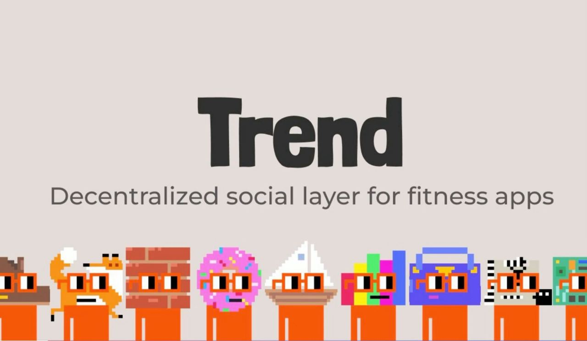

<h1 align="center">chadxeth</h1>

<!-- 

  

 -->

Hi there! I am a blockchain engineer with a passion for decentralized technologies and their potential to change the world.

## Skills
- Experience with smart contract development using Solidity, Typescript, Hardhat/Foundry, Golang
- Understanding of consensus algorithms, cryptography, and network security
- Familiarity with Web3 primitives
- Ability to integrate blockchain solutions with existing systems and platforms
- Web3 native + web3 corporate experience

## Coding Statistics

  <figure style="flex: 1; margin-right: 10px;">
    
  </figure>
  <figure style="flex: 1;">
    
  </figure>

## 2024 Projects

### Trend - Decentralized Social Layer for Fitness  (ETHGlobal Singapore 2024)
### 🥇 Sign Protocol — Best Overall Application 🏆 Sign Protocol - Most Creative Schema 🧑‍⚖️ Worldcoin — Pool Prize

  

Trend introduces a decentralized social layer for fitness apps, allowing users to verify their workout achievements through on-chain attestations. Powered by Sign Protocol, users can create verifiable proof of completed workouts, such as running or cycling with their peers. By recording these activities on-chain, Trend enables composability with other decentralized systems, like reputation protocols, allowing users to build a verified fitness track record that transcends individual platforms. This decentralized approach adds trust and flexibility to fitness data, enabling a richer social experience for users while maintaining privacy and control over their information.

[Project Link](https://ethglobal.com/showcase/trend-p3r89)

### AirdropX - Modular Token Distribution Network  (ETHGlobal Bangkok 2024)
### 🧑‍⚖️ Worldcoin — Pool Prize

AirdropX is a flexible and secure framework for creating customizable token distribution campaigns with pluggable eligibility criteria. Built with security and modularity in mind, it leverages the Venn Protocol for transaction firewall protection.

[Project Link](https://ethglobal.com/showcase/airdropx-wk04h)

## 2023 Projects

### ZKredentials - Decentralized, Trustless Anonymous Verification Powered by ZK-SNARKS  (ETHGlobal Tokyo 2023)
### 🥇 Gnosis Chain — Best Use 🏆 Push — Most Innovative 🧑‍⚖️ Worldcoin — Best Governance App 🥷 Taiko — 🥈 ZK Zone 🏊‍♂️ Polygon — Pool Prize 🏊 The Graph — Pool Prize 📜 Scroll — Just Deploy
### Additional Awards
### 🏆 DevX APAC Hackathon by Polygon Labs - Problem Statement Track Winner 🏆 The Hunt for X by ScalingX - Finalist

  

ZKredentials is a decentralized resume verification platform designed to empower anonymous developers by leveraging zero-knowledge proofs (zk-SNARKs), Ethereum blockchain, and the InterPlanetary File System (IPFS). The platform aims to revolutionize talent discovery and validation for job hunters, while preserving privacy and ensuring security for job seekers.

An increasing number of individuals are seeking anonymity in their interactions, and this extends to their professional lives as well. This growing demand for privacy in the job market, coupled with the rapid expansion of the crypto industry, highlights the necessity for a platform like ZKredentials.

ZKredentials addresses this essential need by providing a secure and privacy-preserving solution for job seekers, allowing them to showcase their skills and credentials without compromising their anonymity. By employing advanced technologies like zk-SNARKs, Ethereum, and IPFS, ZKredentials allows users to generate resumes and verify their qualifications without revealing sensitive personal information.

[Project Link](https://ethglobal.com/showcase/zkredentials-costv)

### Multinate - Cross-Chain Donation Aggregator  (ETHGlobal ScalingEthereum 2023)
### 🏆 Hyperlane — Best use of Hyperlane Warp Routes 🏆 UMA & Across — Pool Prize

  

Multinate is a cross-chain donation aggregator designed to streamline charitable fundraising by enabling donors from multiple blockchain ecosystems to contribute in the ERC-20 token of their choice. Our platform simplifies the donation process, enhances transparency, and empowers charities to withdraw the raised funds in USDC, facilitating the efficient allocation of resources.

Key Features:

Snapshot.org Integration: Multinate utilizes Snapshot.org to initiate fundraising campaigns, providing a preliminary assessment of a charity's legitimacy. Charities submit proposals on our dedicated Multinate space, and these proposals must garner more votes in favor than against to pass.

Gnosis Safe Account and Optimism's AttestationStation: Once the proposal is approved, the platform automatically creates a campaign through a Gnosis Safe account. At this stage, our system connects to Optimism's AttestationStation contract to ensure that the charity meets the minimum attestation score, which is based on four attested criteria from a trusted third party.

Multi-Chain Support: Multinate supports donations from various blockchain ecosystems, including Scroll Alpha, Optimism Mainnet, and Gnosis Mainnet. This broad compatibility enables donors to contribute using their preferred blockchain and token, making it easier than ever to support charitable causes.

USDC Withdrawals: Charities can efficiently access the funds raised through our platform by withdrawing them in USDC, ensuring a seamless and straightforward process from campaign initiation to fund allocation.

[Project Link](https://ethglobal.com/showcase/multinate-kgqay)

### BluebirdSwap - On-chain Fractionalised NFT Options Trading  (ETHDenver #BUIDLathon 2023)
### 🏆 The Graph — Best New Subgraph(s)

  

NFTs (Non-Fungible Tokens) have become increasingly popular in recent years as a way to represent unique digital assets such as artwork, music, and video game items. However, high-value NFTs can be expensive and illiquid, making it difficult for smaller investors to gain exposure to the market.

With BluebirdSwap, users can buy and sell fractional ownership of NFTs, which makes it possible for smaller investors to participate in the market. This allows users to buy a share of a valuable NFT without having to pay the entire price upfront. Fractional ownership also allows investors to diversify their portfolios by owning a stake in multiple NFTs. BluebirdSwap provides a new way to speculate on the value of these assets. This is not possible on OpenSea or other NFT marketplaces, which only support direct trading of NFTs.

In addition to fractionalized NFTs, BluebirdSwap also offers an options trading platform for NFTs. Users can buy calls or puts on fractionalized NFTs, which allows them to potentially profit from price movements without having to buy the entire asset. This provides flexibility and risk management for investors who may not want to take on the full risk of owning an entire NFT. The premium for the options contracts is paid in the specific fractionalized NFT tokens.

[Project Link](https://app.buidlbox.io/projects/bluebirdswap)

### Autopass3 - Autopass powered by Web3 (ETHTaipei Hackathon 2023)

Autopass3 enables web3 payments for Autopass using Gnosis. Drivers can now easily pay for parking, gas, and other automobile services using stable cryptocurrencies such as XDAI on Autopass.

[Project Link](https://taikai.network/ethtaipei/hackathons/hackathon/projects/clgr9v2df122199401019dy019eh/idea)
[Autopass Website](https://en.autopass.xyz/)

## 2022 Projects

### GAAVE - Charity Yield Farming (ETH Seoul 2022)
### 🥇 Public Goods Track Winner 🏆 IPFS/Filecoin Sponsor Prize 🏆 The Graph Sponsor Prize

  

GAAVE is a yield farming for charity platform built by team GigaChads at ETH Seoul 2022.

A platform where crypto users could deposit their cryptocurrencies to generate yield for a cause. To further drive engagement, soulbound NFTs would be available for claim whenever a user reaches certain milestone when generating yield for a cause.

https://github.com/GigaChadds

### PreshMail - Decentralized Chat App with Attention Monetization (ETHGlobal SanFrancisco 2022)
### 🏆 Lens Protocol — Integration 🏆 XMTP — Runner Up 🏆 Push Protocol — Runner Up

  

Modern day social media is plagued with ads and people sending unsolicited messages to strangers due to the ease of doing so via bots and automation. We feel that it is unfair that you have to waste your precious attention on spam and unwanted messages.

Ad services such as Google Ad sense helps you to monetize your attention to a certain degree, but what if we could democratize this whole process?

There are existing solutions out there to do exactly this, such as the Brave browser, but there has not been one in the area of text messaging.

https://github.com/Omegachads

https://ethglobal.com/showcase/preshmail-rnuzb

## Contact

Feel free to reach out to me through [junmtan.eth@gmail.com](mailto:junmtan.eth@gmail.com) or connect with me on [LinkedIn](https://www.linkedin.com/in/tanjunmeng/).
